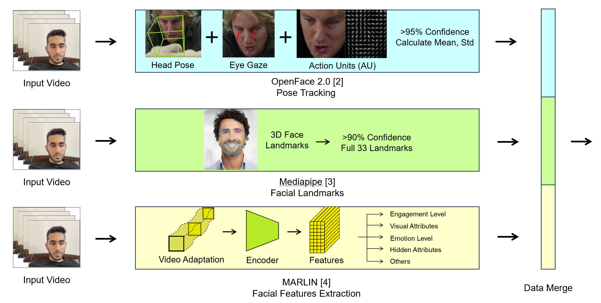
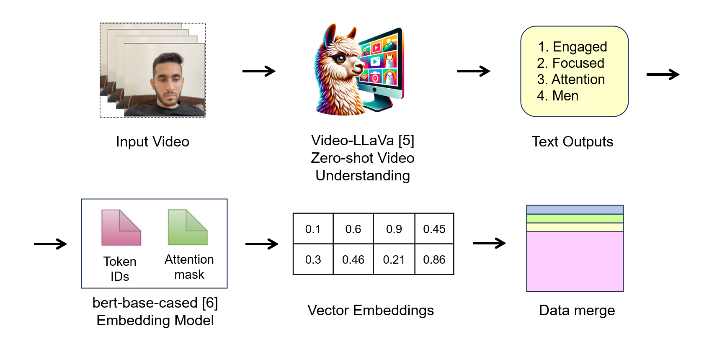

# Multimodal Engagement Classification - EmotiW2024

## Introduction
ACM [EmotiW2024](https://sites.google.com/view/emotiw2024/home) challenge, we focused the subchallenge: Engagement classification on videos.  

Checkout our PowerPoint [here](Presentation.pdf)

## Dataset and baselines
We worked with [EngageNet](https://github.com/engagenet/engagenet_baselines), with a pre-ensemble baseline.  
By data augmentation (flip & color-filter), we ensured that each classes have a minimum of 3500 videos.

## Architecture
The model is ensembled with 4 pipelines: [Pose Tracking](https://github.com/TadasBaltrusaitis/OpenFace), [Facial Landmarks](https://github.com/google-ai-edge/mediapipe), [Facial Features](https://github.com/ControlNet/MARLIN), [Video Understanding](https://github.com/PKU-YuanGroup/Video-LLaVA)

 
  
For Pose Tracking, Facial Landmarks and Facial Features pipelines, its preprocessing is as follows:

 
  
For Video Understanding pipeline, it was built via [Video-LLaVa LLM](https://github.com/PKU-YuanGroup/Video-LLaVA) and [bert-base-cased Embedding](https://huggingface.co/google-bert/bert-base-cased):

## Code Layout
Structure: 
- notebooks/augmentation - Data augmentation
- notebooks/preprocessing - Data preprocessing pipelines
- notebooks/ensemble - Model ensemble from different modalities

## Results
### Individual Modalities
Based on EngageNet Test dataset

| Modality  | Accuracy | F1-Score
| ------------- | ------------- | ------------- |
| Pose | 0.698 | 0.69 |
| Landmark | 0.614 | 0.58 |
| Face | 0.689 | 0.67 |
| Video Understanding | 0.652 | 0.61 |

### Ensembling Performance
| Ensemble  | Accuracy
| ------------- | ------------- |
| Late-Fusion (Hard) | 0.676 |
| Late-Fusion (Soft) | 0.718 |
| Late-Fusion (Weighted) | 0.694 |
| Early-Fusion (Transformer Fusion) | 0.744 |

### Ablation Results
| Ensemble  | Accuracy
| ------------- | ------------- |
| Pose-Land-Face  | 0.743 |
| Pose-Land-Vid  | 0.740 |
| Pose-Face-Vid  | 0.747 |
| Land-Face-Vid | 0.695 |

### Table - Final Ensemble
| Dataset  | Accuracy
| ------------- | -------------
| Validation | 0.713 |
| Test | 0.747 |

## The Team
Yichen Kang, Yanchun Zhang, Jun Wu  
[EESM5900V - HKUST](https://cqf.io/EESM5900V/)  
The Hong Kong University of Science and Technology (HKUST)
