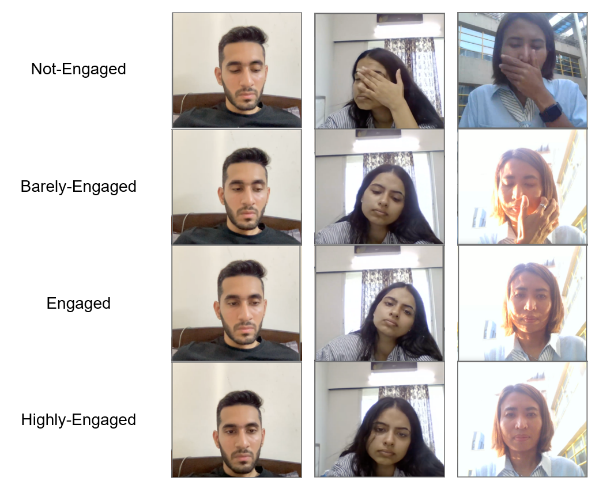
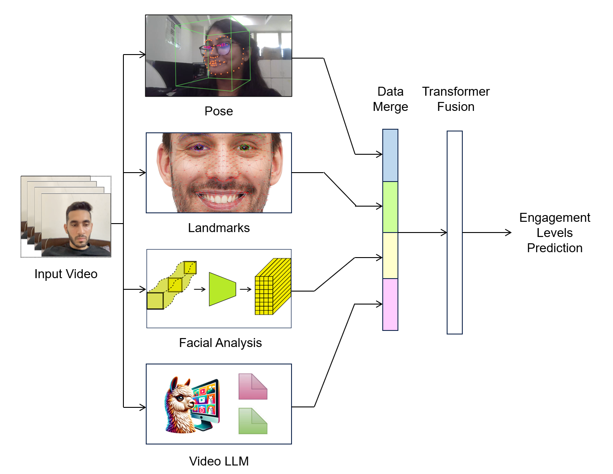

# Multimodal Engagement Classification - EmotiW2024

## Introduction
ACM [EmotiW2024](https://sites.google.com/view/emotiw2024/home) challenge, we focused the subchallenge: Engagement classification on videos.

## Dataset and baselines
We worked with [EngageNet](https://github.com/engagenet/engagenet_baselines), with a pre-ensemble baseline.

## Architecture
The model is ensembled from: Pose Tracking, Facial Landmarks, Facial Features, Video Understanding

## Code Layout
Structure:
- notebooks/augmentation - Data augmentation
- notebooks/preprocessing - Data preprocessing pipelines
- notebooks/ensemble - Model ensemble from different modalities

## Results
### Individual Modalities

| Modality  | Accuracy | F1-Score
| ------------- | ------------- | ------------- |
| Pose  | - | - |
| Landmark  | - | - |
| Face | - | - |
| Video Understanding | - | - |

### Table - Final Ensemble
| Dataset  | Accuracy
| ------------- | -------------
| Validation | **-** |
| Test | **-** |

## The Team
Yichen Kang, Yanchun Zhang, Jun Wu  
[EESM5900V - HKUST](https://cqf.io/EESM5900V/)  
The Hong Kong University of Science and Technology (HKUST)
